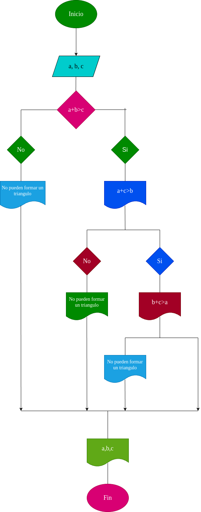

# Quiz instrucciones condicionales

### Realice el análisis, diseño y construcción para resolver el siguiente problema:

Dados tres números a, b y c, correspondientes a la longitud de los lados de una figura geométrica, determinar si pueden formar los lados de un triángulo.

a = longitud del primer lado del triangulo

b = longitud del segundo lado del triangulo

c = longitud del tercer lado del triangulo

En términos matemáticos:

- \( a + b > c \)
- \( a + c > b \)
- \( b + c > a \)

Para que tres longitudes puedan formar un triángulo, deben cumplirse las siguientes condiciones (conocidas como las desigualdades triangulares):
1. La suma de los dos lados más cortos debe ser mayor que el tercer lado.
2. Esta condición debe aplicarse a cada par de lados.

## DISEÑO

### Diagrama de flujo

# Construccion